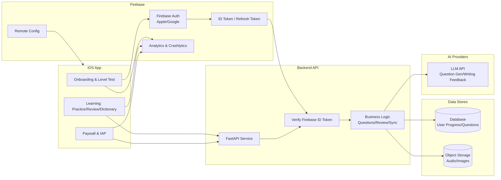

# Volingo Architecture (Phase 1 - Overseas)

> Scope: Phase 1 overseas launch with Firebase Auth + Backend API
> Goal: Fast validation, low ops overhead, scalable path to Phase B (China)

---

## 1. High-Level Architecture

---

## 2. Core Business Flow

### 2.1 Onboarding and Leveling

1. User opens app -> Onboarding
2. User selects target level (KET / PET / Junior / Senior / CET / TOEFL / etc.)
3. Level test (10-20 questions)
4. Pass -> set final level
5. Fail -> suggest downgrade -> re-test

### 2.2 Daily Learning Loop

- Practice (level-based question sets)
- Review (wordbook spaced repetition)
- Dictionary lookup (secondary entry)

### 2.3 Paywall and Upgrade

- Guest mode allowed with daily caps
- Cap reached -> login prompt
- Login -> IAP subscription -> unlimited access

---

## 3. Data Flow

### 3.1 Auth Flow

1. iOS -> Firebase Auth (Apple/Google)
2. Firebase returns ID Token
3. iOS -> Backend `/auth/verify`
4. Backend verifies token -> issues session/JWT

### 3.2 Question Flow

1. iOS -> Backend `/questions?level=...`
2. Backend checks DB cache
3. If missing, call LLM -> generate questions
4. Cache questions -> return to iOS

### 3.3 Wordbook Sync Flow

1. iOS collects local changes
2. iOS -> Backend `/wordbook/sync`
3. Backend merges -> writes DB
4. Backend returns latest snapshot

### 3.4 Writing Feedback Flow

1. iOS -> Backend `/writing/submit`
2. Backend -> LLM for feedback
3. Save feedback to DB
4. Return structured feedback to iOS

---

## 4. Data Model (Minimal)

### 4.1 User Profile

- `userId`
- `displayName`
- `email`
- `level`
- `createdAt`
- `lastActiveAt`

### 4.2 Wordbook Item

- `word`
- `addedAt`
- `correctCount`
- `wrongCount`
- `nextReviewAt`

### 4.3 Question

- `id`
- `level`
- `type`
- `stem`
- `options[]`
- `correctIndex`
- `explanation`

### 4.4 Writing Feedback

- `submissionId`
- `score`
- `grammarIssues[]`
- `suggestions[]`
- `revisedText`

---

## 5. Non-Functional Requirements

- Token validation on every API call
- Rate limit AI generation endpoints
- Cache AI results to reduce cost
- Offline fallback to local question bank
- Analytics for funnel tracking

---

## 6. Phase B Compatibility Notes (China)

- Auth: add WeChat + SMS login
- Hosting: migrate or replicate backend in China region
- AI: switch to compliant domestic providers
- Payments: add WeChat/Alipay for non-iOS channels

---

## 7. Home Screen IA and Tabs (Plan B)

### 7.1 Home Screen Information Architecture (Top to Bottom)

1. Header
  - Current level/grade
  - Short daily goal line
2. Today Recommendation Package (Primary Card)
  - Total questions, estimated time, type mix
  - Primary CTA: start today package
  - Secondary CTA: view type breakdown
3. Special Training Groups (Scrollable)
  - Question types: MCQ, cloze, reading, translation, rewriting, error fix, ordering
  - Skills: listening, speaking, writing, vocabulary, grammar
  - Scenarios: campus, travel, workplace, daily life
  - Lightweight: 5-min sprint, error review, timed challenge
4. Review and Weakness
  - Today error review
  - Recent weak types
5. Lightweight Progress
  - Weekly questions done
  - Streak

### 7.2 Tab Structure (Plan B)

1. Home
  - Today recommendation package + special training
2. Dictionary
  - Word lookup, examples, pronunciation, favorites
3. Me
  - Progress, error bank, achievements, settings
