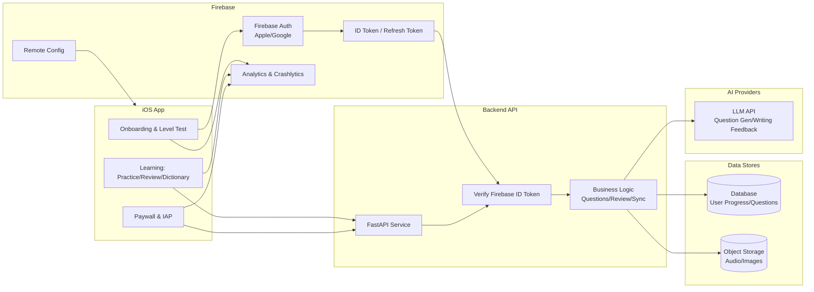

# Volingo – 中国人专属的智能英语学习APP

## 一、项目背景与市场分析

### 1. 市场现状
- 中国英语学习市场规模巨大，在线英语教育市场规模已超千亿人民币，且持续增长。
- 用户类型广泛：学生（KET、PET、雅思、托福备考）、职场人士、兴趣学习者。
- 现有产品多为单点功能（如背单词、口语训练），缺乏 **全链路、交互式、多考试覆盖** 的综合型产品。

### 2. 痛点分析
- **内容割裂**：单词、口语、写作分散在不同APP中
- **缺乏个性化反馈**：互动性弱，学习动力不足
- **应试与实际应用脱节**：考试与生活/工作英语之间无顺畅过渡
- **场景化不足**：多数APP缺乏真实场景的深度模拟

### 3. 市场机会
- 利用 AI 与情景交互，构建查词—记忆—练习—应用—反馈的学习闭环
- 专门针对中国用户优化语境与学习路径
- 结合传统教材优势与数字化互动体验

---

## 二、产品定位与核心价值

> **产品愿景**：为中国人量身打造的全场景英语学习APP，集查词、生词本、情景口语、写作交互、做题测评于一体

### 目标用户群体
- **学生群体**：KET、PET、雅思、托福、四六级备考者
- **职场人士**：需要英语工作的白领、出国人员
- **兴趣学习者**：提升日常英语交流能力的用户

### 核心差异化价值
- **全链路学习闭环**：从查词到应用的完整学习路径
- **深度场景化**：细分到具体使用场景的对话训练
- **AI智能导学**：个性化学习路径推荐与实时反馈
- **应试实用双轨**：既满足考试需求，又提升实际交流能力

---

## 三、功能架构设计

### 3.1 智能查词系统 🔍

#### 核心功能
- **英汉双向查询**: 支持英文查中文、中文查英文
- **权威词典数据**: 基于牛津、朗文等权威词典数据
- **发音与音标**: 美式/英式发音，国际音标标注
- **词性与变形**: 完整的词性标注和词形变化
- **例句与搭配**: 丰富的真实例句和常用搭配

#### 创新特性
- **场景关联**: 查词时自动关联相关情景对话
- **智能推荐**: 根据学习目标推荐相关词汇
- **一键收藏**: 查词即可添加到生词本，无阻力学习

### 3.2 智能生词本系统 📚

#### 设计理念
传统生词本存在"查词即走、复习阻力大、收藏多行动少"等问题。我们重新定义生词本价值：

> **核心理念**: 基于艾宾浩斯遗忘曲线的智能复习，让生词从短期记忆自然过渡到长期记忆

#### 科学复习机制
**极简化设计**: 生词一旦添加，就通过科学的时间间隔反复复习，无复杂状态区分。

**复习间隔序列**: 10分钟 → 1小时 → 8小时 → 1天 → 3天 → 1周 → 2周 → 1个月 → 3个月 → 6个月

**动态调整**: 
- 答对 ✅ → 进入下一个更长间隔
- 答错 ❌ → 回退到上一个更短间隔

#### 基于例句的练习系统
- **填空题**: 在词典例句中填入目标单词
- **选择题**: 从选项中选择正确单词
- **释义题**: 根据语境理解词汇含义

### 3.3 深度情景对话系统 🎤

#### 多层次场景设计
- **大场景分类**: 机场、餐厅、商务、日常等
- **细分子场景**: 机场→过安检/办登机/海关通关
- **真实语料**: 基于真实对话场景的语料库

#### 交互学习功能
- **点读播放**: 单句点读，重点语句反复练习
- **跟读评分**: AI语音评测，实时发音纠正
- **角色扮演**: 模拟真实对话场景
- **语法解析**: 重点句型和语法知识点分析

#### 智能关联
- **词汇融入**: 生词本中的词汇自动融入相关情景
- **渐进式难度**: 根据用户水平调整对话复杂度

### 3.4 交互式写作训练 ✏️

#### AI智能批改
- **实时语法检查**: 写作过程中的实时语法提示
- **用词建议**: 基于语境的用词优化建议
- **句式改进**: 句型结构和表达方式改进
- **整体评分**: 综合评估写作水平并给出具体建议

#### 场景化写作
- **主题写作**: 结合情景对话的主题写作练习
- **应用文写作**: 邮件、报告、简历等实用文体
- **创意写作**: 提升英语表达的创造力和流畅度

#### 个性化反馈
- **错误模式分析**: 识别用户常见错误类型
- **针对性练习**: 推荐专项改进练习
- **进步追踪**: 写作水平的长期进步分析

### 3.5 智能题库系统 📝

#### 多考试覆盖
- **标准化考试**: KET、PET、雅思、托福、四六级
- **专项训练**: 听力、阅读、语法、词汇专项
- **模拟考试**: 完整的考试模拟和计时训练

#### 智能推荐
- **场景关联**: 学习情景后推送相关题目
- **薄弱点练习**: 基于错题分析推荐练习
- **个性化题库**: 根据学习目标定制题目

#### 数据分析
- **错题管理**: 智能错题本，重点复习
- **能力评估**: 各项技能的详细能力分析
- **学习建议**: 基于数据的个性化学习建议

### 3.6 个人学习中心 👤

#### 学习数据统计
- **学习时长**: 每日、每周、每月学习时间统计
- **掌握词汇**: 词汇量增长和掌握程度分析
- **技能进步**: 听说读写各项技能提升轨迹
- **目标完成**: 学习目标设定和完成情况

#### 个性化设置
- **学习目标**: KET、PET、雅思、托福等不同目标设定
- **学习计划**: 每日学习量和学习时间安排
- **提醒设置**: 个性化的学习提醒和复习提醒

#### 成就系统
- **学习里程碑**: 词汇量、学习天数等成就解锁
- **技能徽章**: 各项技能达到一定水平的认证
- **学习报告**: 定期的学习总结和改进建议

### 3.7 学习闭环设计

```
查词学习 → 生词收藏 → 情景应用 → 写作练习 → 题库测评 → 数据反馈 → 个性化推荐
    ↑                                                                      ↓
    ←←←←←←←←←←←←← AI智能路径规划 ←←←←←←←←←←←←←←←←←←←←←←←←←←←
```

#### 核心特色
- **全学习链闭环**: 查词 → 记忆 → 应用 → 测评的完整学习路径
- **AI个性化导学**: 动态推荐学习任务和练习内容
- **本土化优化**: 例句与场景贴近中国学习者需求
- **应试实用双轨**: 既满足考试需求，又提升实际交流能力

---

## 四、产品特色
- **全学习链闭环**：查词 → 背词 → 应用 → 测评
- **AI个性化路径**：动态推荐任务
- **本地化优化**：例句与场景贴近中国学习者
- **双向价值**：既能应试，也能实用

---

## 四、技术架构设计（iOS SwiftUI）

### 4.0 Phase 1 海外架构设计 (Firebase + Backend)



### 4.1 核心技术栈

| 技术层次 | 技术选型 | 说明 |
|----------|----------|------|
| **UI层** | SwiftUI + Combine | 声明式UI，响应式数据绑定 |
| **架构** | MVVM + 模块化 | 清晰的分层架构，便于维护扩展 |
| **数据层** | SQLite + JSON + Core Data | 词典数据（SQLite）+ 用户数据（JSON/Core Data） |
| **网络层** | URLSession + Async/Await | 现代化异步网络请求 |
| **音频** | AVFoundation + Speech | 音频播放、录音、语音识别 |
| **AI集成** | OpenAI API + 本地模型 | 写作批改、语音评分、学习推荐 |
| **认证** | Sign in with Apple | 隐私友好的用户认证 |

### 4.2 模块化架构设计

#### 总体架构分层
```
Volingo/
├── App/                    # 应用入口层
├── Features/               # 功能模块层 (按业务垂直切分)
├── Shared/                # 共享组件层 (水平复用)
├── Core/                  # 核心业务层
└── Resources/             # 资源文件层
```

#### 详细模块拆分

##### 📱 应用入口层 (App/)
```
App/
├── VolingoApp.swift       # 应用启动配置
├── ContentView.swift      # 主TabView容器
├── AppDelegate.swift      # 应用代理 (推送、后台等)
└── SceneDelegate.swift    # 场景管理
```

##### 🎯 功能模块层 (Features/) - 垂直业务切片
```
Features/
├── Dictionary/            # 📖 查词模块
│   ├── Views/
│   │   ├── DictionaryView.swift           # 主查词界面
│   │   ├── SearchBarView.swift            # 搜索栏组件
│   │   ├── WordDetailView.swift           # 单词详情页
│   │   ├── PronunciationView.swift        # 发音播放组件
│   │   └── ExampleSentenceView.swift      # 例句展示组件
│   ├── ViewModels/
│   │   ├── DictionaryViewModel.swift      # 查词业务逻辑
│   │   ├── SearchViewModel.swift          # 搜索状态管理
│   │   └── WordDetailViewModel.swift      # 单词详情逻辑
│   ├── Models/
│   │   ├── Word.swift                     # 单词数据模型
│   │   ├── Definition.swift               # 释义模型
│   │   ├── Pronunciation.swift            # 发音模型
│   │   └── SearchResult.swift             # 搜索结果模型
│   └── Services/
│       ├── DictionaryService.swift        # 词典查询服务
│       ├── SearchService.swift            # 搜索引擎服务
│       └── PronunciationService.swift     # 发音服务
│
├── Wordbook/              # 📚 生词本模块
│   ├── Views/
│   │   ├── WordbookView.swift             # 生词本主界面
│   │   ├── WordListView.swift             # 生词列表
│   │   ├── StudyModeView.swift            # 学习模式选择
│   │   ├── FlashCardView.swift            # 单词卡片
│   │   ├── ReviewView.swift               # 复习界面
│   │   └── ProgressView.swift             # 学习进度
│   ├── ViewModels/
│   │   ├── WordbookViewModel.swift        # 生词本管理
│   │   ├── StudyViewModel.swift           # 学习状态管理
│   │   ├── ReviewViewModel.swift          # 复习算法控制
│   │   └── ProgressViewModel.swift        # 进度统计
│   ├── Models/
│   │   ├── SavedWord.swift                # 已保存单词
│   │   ├── StudyRecord.swift              # 学习记录
│   │   ├── ReviewSchedule.swift           # 复习计划
│   │   └── LearningStats.swift            # 学习统计
│   └── Services/
│       ├── WordbookService.swift          # 生词本数据服务
│       ├── MemoryEngine.swift             # 记忆曲线算法
│       └── StudyPlanService.swift         # 学习计划服务
│
├── Scenario/              # 🎤 情景对话模块
│   ├── Views/
│   │   ├── ScenarioView.swift             # 情景选择界面
│   │   ├── ScenarioListView.swift         # 情景分类列表
│   │   ├── DialogueView.swift             # 对话播放界面
│   │   ├── SentenceView.swift             # 单句点读组件
│   │   ├── RecordingView.swift            # 录音跟读界面
│   │   └── ScoreView.swift                # 评分结果展示
│   ├── ViewModels/
│   │   ├── ScenarioViewModel.swift        # 情景选择逻辑
│   │   ├── DialogueViewModel.swift        # 对话播放控制
│   │   ├── RecordingViewModel.swift       # 录音状态管理
│   │   └── ScoringViewModel.swift         # 评分结果处理
│   ├── Models/
│   │   ├── Scenario.swift                 # 情景数据模型
│   │   ├── Dialogue.swift                 # 对话内容模型
│   │   ├── AudioClip.swift                # 音频片段模型
│   │   ├── RecordingSession.swift         # 录音会话
│   │   └── SpeechScore.swift              # 语音评分
│   └── Services/
│       ├── ScenarioService.swift          # 情景数据服务
│       ├── AudioService.swift             # 音频播放服务
│       ├── RecordingService.swift         # 录音服务
│       └── SpeechEvaluationService.swift  # 语音评测服务
│
├── Writing/               # ✏️ 写作训练模块
│   ├── Views/
│   │   ├── WritingView.swift              # 写作主界面
│   │   ├── ExerciseListView.swift         # 练习题目列表
│   │   ├── WritingEditorView.swift        # 写作编辑器
│   │   ├── FeedbackView.swift             # 批改反馈界面
│   │   ├── GrammarTipView.swift           # 语法提示组件
│   │   └── ImprovementView.swift          # 改进建议展示
│   ├── ViewModels/
│   │   ├── WritingViewModel.swift         # 写作练习管理
│   │   ├── EditorViewModel.swift          # 编辑器状态
│   │   ├── FeedbackViewModel.swift        # 反馈处理逻辑
│   │   └── GrammarViewModel.swift         # 语法检查逻辑
│   ├── Models/
│   │   ├── WritingExercise.swift          # 写作练习题
│   │   ├── WritingSubmission.swift        # 用户提交内容
│   │   ├── GrammarFeedback.swift          # 语法反馈
│   │   ├── StyleFeedback.swift            # 文体反馈
│   │   └── ScoringSummary.swift           # 评分摘要
│   └── Services/
│       ├── WritingService.swift           # 写作练习服务
│       ├── GrammarCheckService.swift      # 语法检查服务
│       ├── StyleAnalysisService.swift     # 文体分析服务
│       └── WritingAIService.swift         # AI写作批改服务
│
└── Profile/               # 👤 个人中心模块
    ├── Views/
    │   ├── ProfileView.swift              # 个人中心主页
    │   ├── LoginView.swift                # 登录界面
    │   ├── SettingsView.swift             # 设置界面
    │   ├── StatsView.swift                # 学习统计界面
    │   ├── GoalsView.swift                # 学习目标设置
    │   └── PracticeView.swift             # 做题练习入口
    ├── ViewModels/
    │   ├── ProfileViewModel.swift         # 用户信息管理
    │   ├── AuthViewModel.swift            # 认证状态管理
    │   ├── SettingsViewModel.swift        # 设置选项管理
    │   └── StatsViewModel.swift           # 统计数据处理
    ├── Models/
    │   ├── UserProfile.swift              # 用户档案
    │   ├── UserSettings.swift             # 用户设置
    │   ├── LearningGoal.swift             # 学习目标
    │   └── Achievement.swift              # 成就系统
    └── Services/
        ├── AuthService.swift              # 认证服务
        ├── ProfileService.swift           # 用户信息服务
        └── SyncService.swift              # 数据同步服务
```

##### 🔧 共享组件层 (Shared/) - 水平复用切片
```
Shared/
├── UI/                    # 通用UI组件
│   ├── Components/
│   │   ├── CustomButton.swift            # 自定义按钮
│   │   ├── LoadingView.swift             # 加载状态组件
│   │   ├── ErrorView.swift               # 错误提示组件
│   │   ├── SearchBar.swift               # 通用搜索栏
│   │   ├── ProgressBar.swift             # 进度条组件
│   │   └── AudioPlayer.swift             # 音频播放器组件
│   ├── Modifiers/
│   │   ├── CardModifier.swift            # 卡片样式修饰器
│   │   ├── ShadowModifier.swift          # 阴影效果修饰器
│   │   └── AnimationModifier.swift       # 动画效果修饰器
│   └── Styles/
│       ├── Colors.swift                  # 应用色彩定义
│       ├── Fonts.swift                   # 字体样式定义
│       └── Spacing.swift                 # 间距规范定义
│
├── Utils/                 # 工具类库
│   ├── Extensions/
│   │   ├── String+Extensions.swift       # 字符串扩展
│   │   ├── View+Extensions.swift         # 视图扩展
│   │   ├── Date+Extensions.swift         # 日期扩展
│   │   └── Color+Extensions.swift        # 颜色扩展
│   ├── Helpers/
│   │   ├── ValidationHelper.swift        # 数据验证工具
│   │   ├── FormatHelper.swift            # 格式化工具
│   │   ├── AudioHelper.swift             # 音频处理工具
│   │   └── FileHelper.swift              # 文件操作工具
│   └── Constants/
│       ├── AppConstants.swift            # 应用常量
│       ├── APIConstants.swift            # API常量
│       └── LocalizationKeys.swift        # 本地化键值
│
└── Models/                # 共享数据模型
    ├── BaseModels/
    │   ├── Identifiable.swift            # 可识别协议
    │   ├── Codable.swift                 # 编码协议扩展
    │   └── Equatable.swift               # 相等性协议扩展
    ├── NetworkModels/
    │   ├── APIResponse.swift             # API响应基础模型
    │   ├── APIError.swift                # API错误模型
    │   └── PaginationModel.swift         # 分页模型
    └── LocalModels/
        ├── CacheModel.swift              # 缓存数据模型
        └── PreferenceModel.swift         # 偏好设置模型
```

##### ⚙️ 核心业务层 (Core/) - 基础设施切片
```
Core/
├── Network/               # 网络层
│   ├── NetworkManager.swift             # 网络管理器
│   ├── APIClient.swift                  # API客户端
│   ├── RequestBuilder.swift             # 请求构建器
│   └── ResponseHandler.swift            # 响应处理器
│
├── Storage/               # 存储层
│   ├── DatabaseManager.swift            # 数据库管理器
│   ├── SQLiteService.swift              # SQLite服务
│   ├── FileStorageService.swift         # 文件存储服务
│   └── CacheManager.swift               # 缓存管理器
│
├── AI/                    # AI服务层
│   ├── OpenAIService.swift              # OpenAI集成服务
│   ├── SpeechRecognitionService.swift   # 语音识别服务
│   ├── TextAnalysisService.swift        # 文本分析服务
│   └── RecommendationEngine.swift       # 推荐引擎
│
└── Analytics/             # 分析统计层
    ├── AnalyticsManager.swift           # 统计管理器
    ├── EventTracker.swift               # 事件追踪器
    └── PerformanceMonitor.swift         # 性能监控器
```

##### 📦 资源文件层 (Resources/)
```
Resources/
├── Database/              # 数据库文件
│   ├── dictionary.sqlite              # 词典数据库
│   └── scenarios.sqlite               # 情景数据库
├── Audio/                 # 音频资源
│   ├── Pronunciations/                # 单词发音音频
│   ├── Scenarios/                     # 情景对话音频
│   └── UI/                           # 界面音效
├── Images/                # 图片资源
│   ├── Icons/                        # 图标文件
│   ├── Scenarios/                    # 情景插图
│   └── UI/                          # 界面图片
└── Localization/          # 本地化文件
    ├── en.lproj/                     # 英文本地化
    └── zh-Hans.lproj/                # 简体中文本地化
```

#### 模块间通信机制

1. **垂直通信**: 同一功能模块内，View → ViewModel → Service → Model
2. **水平通信**: 不同功能模块间通过共享Service和EventBus通信
3. **依赖注入**: 使用协议和依赖注入容器管理模块依赖关系
4. **事件驱动**: 关键业务事件通过NotificationCenter或Combine发布订阅

### 4.3 核心服务设计

#### 数据服务层
- **DictionaryService**: 本地SQLite词典查询，支持模糊匹配和精确查找
- **WordbookService**: 生词本管理，本地JSON存储，支持同步和备份
- **ScenarioService**: 情景数据管理，音频播放控制
- **AIService**: AI功能集成，写作批改、语音评分、学习推荐
- **StorageService**: 统一的本地存储管理
- **NetworkService**: 网络请求封装，支持离线缓存

#### 业务逻辑层
- **StudyPathEngine**: 学习路径规划算法
- **MemoryEngine**: 记忆曲线计算与复习提醒
- **ProgressTracker**: 学习进度跟踪与数据分析
- **RecommendationEngine**: 个性化内容推荐

### 4.4 数据模型设计

#### 核心实体模型
```swift
// 词汇相关
struct Word: Codable, Identifiable
struct Definition: Codable
struct SavedWord: Codable
struct StudyRecord: Codable

// 情景相关
struct Scenario: Codable, Identifiable
struct Dialogue: Codable
struct ScenarioProgress: Codable

// 用户相关
struct UserProfile: Codable
struct LearningGoal: Codable
struct StudyStats: Codable
```  

---

## 五、开发路线图

### 第一阶段 (0-3个月) - MVP版本
**目标**: 核心功能可用，形成基本学习闭环

- [x] 项目架构搭建
- [ ] 查词功能 + 基础生词本
- [ ] 简单情景对话点读
- [ ] 基础写作批改
- [ ] 用户账号系统

### 第二阶段 (3-6个月) - 增强版本
**目标**: AI功能完善，学习体验优化

- [ ] 语音评分系统
- [ ] 高级写作批改
- [ ] 题库系统集成
- [ ] 学习路径推荐
- [ ] 数据分析面板

### 第三阶段 (6-12个月) - 完整版本
**目标**: 功能完备，商业化准备

- [ ] 社区功能
- [ ] 多场景扩展
- [ ] 游戏化学习
- [ ] 付费功能
- [ ] 数据同步与备份

---

## 六、商业模式与变现

### 收入模式
- **订阅制会员**: 高级AI功能、完整题库、无限制使用
- **单项付费**: 专项课程、一对一批改、考试冲刺包
- **企业服务**: 定制化企业英语培训解决方案
- **内容合作**: 与出版社、培训机构的内容授权合作

### 用户价值
- **学生**: 提高考试成绩，降低培训成本
- **职场**: 提升工作英语能力，增强职业竞争力
- **兴趣**: 轻松愉快的学习体验，实用的交流技能

---

## 七、风险评估与应对

| 风险类型 | 具体风险 | 应对策略 |
|----------|----------|----------|
| **技术风险** | AI准确性不足 | 持续优化算法，引入用户反馈机制 |
| **竞争风险** | 巨头公司进入 | 专注差异化定位，深耕细分场景 |
| **用户风险** | 留存率低 | 游戏化机制，个性化推荐，社区建设 |
| **商业风险** | 变现困难 | 多元化收入模式，分阶段推出付费功能 |

---

## 八、项目信息

- **版本**: MVP v1.0 (预计3个月内发布)
- **开发团队**: iOS开发 + AI算法 + 内容设计
- **许可协议**: 商业闭源
- **项目周期**: 12个月完整版本

---

## 九、全球先行商业化计划

> 核心策略: 先全球上架(除中国大陆)验证商业模式, 再回攻国内市场

### 1. 总体策略

- **Phase A (全球市场优先)**: 个人开发者账号上架全球 App Store, 使用 Azure 云 + Google/Apple 登录, 快速验证留存和付费
- **Phase B (中国大陆市场)**: 商业模式验证后, 注册公司、ICP备案、软著申请, 接入国内登录与支付, 进入中国区上架

### 2. 先全球的优势

- **低行政成本**: 无需公司注册、ICP备案即可上线
- **上线速度快**: App Store 全球区审核周期短
- **覆盖海外华人**: 大量海外华人和非中国区 Apple ID 用户
- **美元定价更高**: 订阅单价更高, 收益更可观
- **品牌背书**: "海外知名 App" 更易回攻国内

### 3. Phase A (全球市场) - 1 周 MVP 上线

**目标**: 以现有词典+生词本+复习为核心, 补齐 Onboarding 和题库, 先上线全球区

**关键交付**:
- **Onboarding**: 选择学习目标(KET/初中/高中/四级/六级/考研/托福/日常)
- **等级练习**: AI 预生成题库 JSON, 覆盖多题型
- **复习优化**: 题目选项从词典库随机抽取, 替换硬编码列表
- **用户中心**: 等级、学习统计、打卡、每日目标
- **Tab 精简**: 词典/练习/生词本/我的

**验收标准**:
- 新用户可以完成 Onboarding
- 查词 → 加入生词本 → 复习完整闭环
- 等级练习可用, 每等级至少 100 题
- App Store 全球区审核通过

### 4. Phase A (全球市场) - 2-4 周云端 + AI

**云端基础设施 (Azure)**:
- App Service (FastAPI)
- Cosmos DB (Serverless)
- Blob Storage
- Static Web Apps (隐私政策/落地页)

**核心能力**:
- Google Sign-In + Sign in with Apple
- 生词本云端同步
- AI 动态出题(基于用户学习内容)
- AI 写作批改
- IAP 订阅(月/年)

**验收标准**:
- 登录、云同步、动态出题、写作批改全部跑通
- 订阅流程可用

### 5. Phase B (中国大陆市场) - 回攻策略

**行政准备**:
- 苏州注册有限公司
- ICP 备案
- 软著申请

**技术适配**:
- 登录: 微信 + 手机验证码
- 支付: iOS IAP, 如做 Android/网页则加微信/支付宝
- 云端: Azure 中国区或国内云
- AI: DeepSeek/通义千问等国内合规模型

**运营策略**:
- 关键词 ASO: 背单词/英语学习/四级/考研
- 内容种草: 小红书/抖音/B站
- 邀请裂变: 邀请得 VIP 天数

### 6. 订阅体系建议 (全球)

| 方案 | 价格(USD) | 功能 |
|------|-----------|------|
| Free | $0 | 每日查词 30 次、生词本 50 词、基础练习 10 题 |
| Pro 月卡 | $3.99/月 | 无限查词+无限生词本+AI 动态出题 |
| Pro 年卡 | $29.99/年 | Pro 全部 + AI 写作批改 + 情景对话 + 语音评测 |

### 7. 风险与应对

- **AI 内容质量波动**: 预生成题库 + 人工抽检
- **API 成本过高**: 缓存题目、限制高频调用
- **海外用户规模不足**: 增加英文界面和非华人学习路径
- **国内竞争激烈**: 以 AI 个性化和情景对话差异化